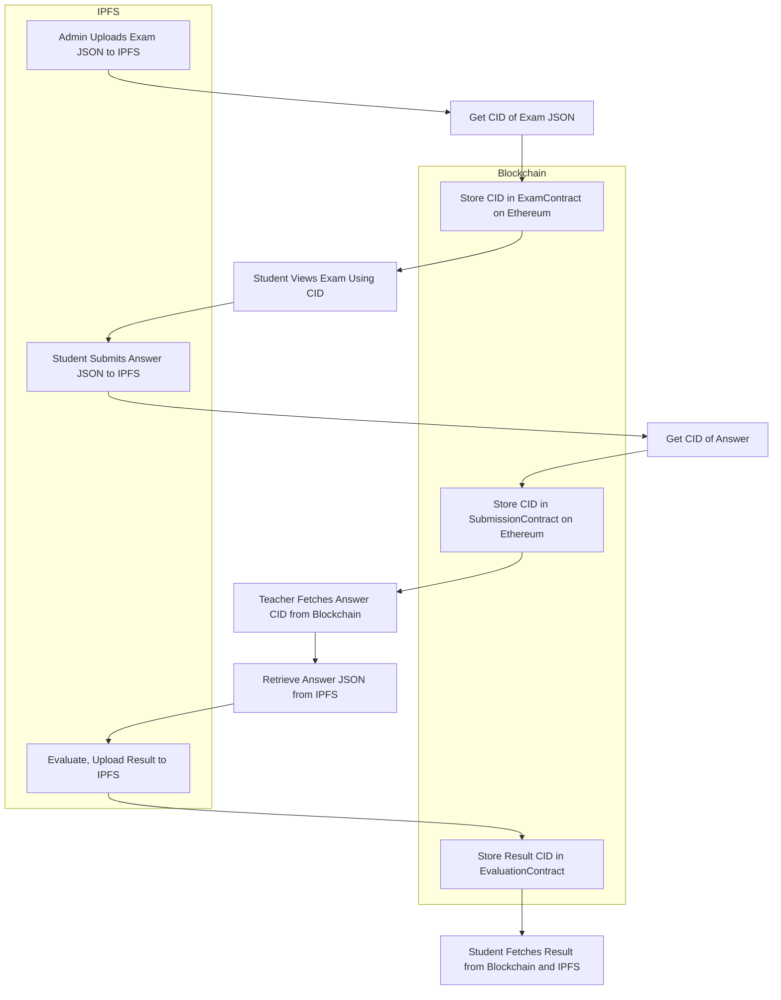

# 🎓 Blockchain-Based Online Examination System

A decentralized, secure, and transparent solution for conducting online exams using **Ethereum**, **IPFS**, and **Smart Contracts**.

---

## 📖 Table of Contents

- [📌 Introduction](#📌-introduction)
- [🔍 Project Overview](#🔍-project-overview)
- [⚙️ How Does It Work?](#️-how-does-it-work)
- [🧠 Architecture Flow (Mermaid Diagram)](#-architecture-flow-mermaid-diagram)
- [🧩 Technologies Used](#-technologies-used)
- [🧪 Example Workflow](#-example-workflow-step-by-step)
- [👥 Roles & Responsibilities](#-roles--responsibilities)
- [🚀 Getting Started](#-getting-started)
- [🎯 Hackathon Goal](#-hackathon-goal)
- [📷 Screenshots](#-screenshots) 
- [📜 License](#-license)

---

## 📌 Introduction

This project aims to eliminate security issues, manipulation, and central authority in online examination systems by leveraging **blockchain technology**. The system ensures:

- Tamper-proof question & answer storage
- Fair evaluation and transparent results
- Immutable logs of all exam-related actions

---

## 🔍 Project Overview

In recent times, major examination systems have suffered from issues like paper leaks and manipulated result data. Our **blockchain-based exam portal** provides:

- ✅ **Decentralization** — IPFS for question/answer storage  
- ✅ **Transparency** — Immutable records on Ethereum  
- ✅ **Security** — Role-restricted smart contract logic  
- ✅ **Automation** — Streamlined exam lifecycle

---

## ⚙️ How Does It Work?

### 📌 1. Exam Creation (Admin Role)
- Admin uploads questions as a JSON file to **IPFS**
- Receives a **CID (Content Identifier)**
- CID is stored in `ExamContract.sol` on **Ethereum**
- Students can **view**, not **edit**

### 📌 2. Student Submission (Student Role)
- Student answers questions offline
- Uploads answer JSON to **IPFS**
- CID is stored in `SubmissionContract.sol` on Ethereum

### 📌 3. Evaluation (Teacher/Admin Role)
- Teacher fetches answer using CID from IPFS
- Evaluates, uploads result to IPFS
- Stores result CID in `EvaluationContract.sol`

### 📌 4. Result Viewing (Student Role)
- Students fetch result CID from Ethereum
- View results and feedback from IPFS

---

## 🧠 Architecture Flow (Mermaid Diagram)

> Use the VS Code `Markdown Preview Mermaid Support` extension or GitHub preview to view this chart.



---

## 🧩 Technologies Used

| Component             | Technology                              |
|----------------------|------------------------------------------|
| Frontend             | React.js + Ethers.js                     |
| Backend              | Golang + Geth                            |
| Blockchain           | Ethereum (Sepolia Testnet)              |
| Smart Contracts      | Solidity                                 |
| Storage              | IPFS                                     |
| Authentication       | MetaMask Wallet                          |


---

## 🧪 Example Workflow (Step-by-Step)

1. ✅ **Admin** uploads exam (JSON) → IPFS → stores CID on Ethereum  
2. 🧑‍🎓 **Student** submits answers (JSON) → IPFS → stores CID on Ethereum  
3. 🧑‍🏫 **Teacher/Admin** fetches answers → evaluates → uploads evaluated JSON to IPFS → stores result CID  
4. 🔍 **Student** retrieves result CID → fetches score from IPFS → reads feedback  

---

## 👥 Roles & Responsibilities

| Team Member             | Role & Responsibilities                                                                 |
|-------------------------|------------------------------------------------------------------------------------------|
| **UI/UX Designer**       | Design clean, intuitive frontend. Collaborate on MetaMask flows and result display UI. |
| **Frontend Developer**   | Build React interface, integrate Ethers.js, handle wallet connection via MetaMask.     |
| **Smart Contract Dev**   | Write & deploy Solidity contracts (Exam, Submission, Evaluation). Secure access.       |
| **Backend Developer**    | Build Go backend, connect to Geth, manage API calls and IPFS file management.          |
| **Security Specialist**  | Audit smart contracts, optimize gas, test vulnerabilities (via Remix/Hardhat).        |

---

## 🚀 Getting Started

### ✅ Prerequisites

- Node.js, npm
- Go installed
- MetaMask browser extension
- IPFS CLI installed
- Sepolia ETH in MetaMask

### 🔧 Installation

```bash
# Clone the repository
git clone https://github.com/your-repo/blockchain-exam-system.git
cd blockchain-exam-system

# Install frontend dependencies
npm install
```

### ⚒️ Smart Contract Deployment

- Use Remix or Hardhat to deploy:
  - `ExamContract.sol`
  - `SubmissionContract.sol`
  - `EvaluationContract.sol`

- Add contract addresses to `.env` or config files

### ▶️ Run the Project

```bash
# Start React frontend
npm start

# Start Go backend (assuming main.go exists)
go run main.go
```
## 📷 Screenshots


## 📜 License

This project is licensed under the **MIT License**. Feel free to fork, use, or contribute.

---

> 🛠 Built with 💙 at Hack 5.0 
> 🧑‍💻 Team: Paradox

